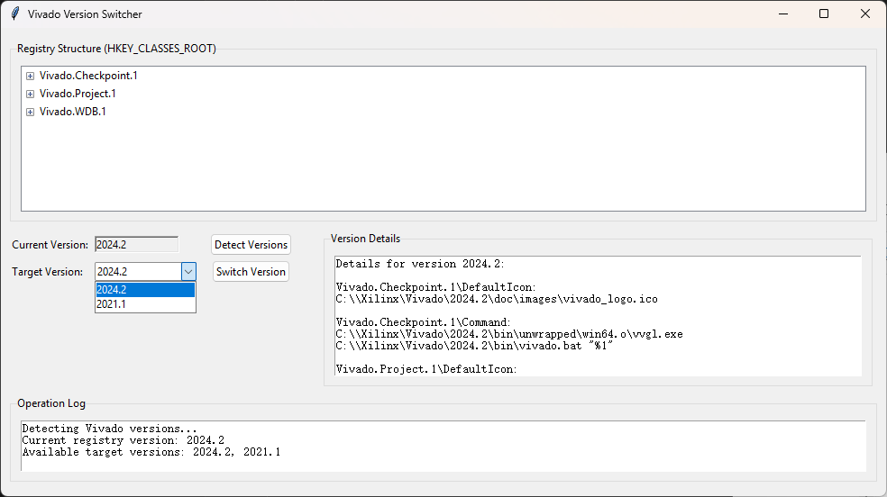

# vivado version switch (registry)

- Modify registry vivado version, so we can open project with corret vivado version.
- Should be repalced by a program which can select vivado version to be opened dynamically.

